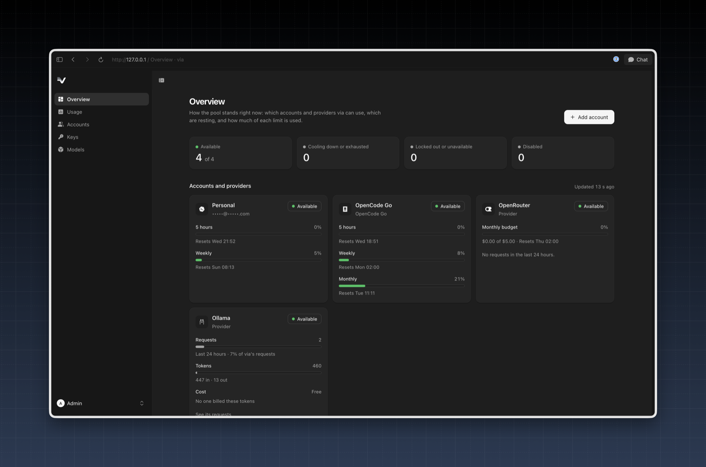
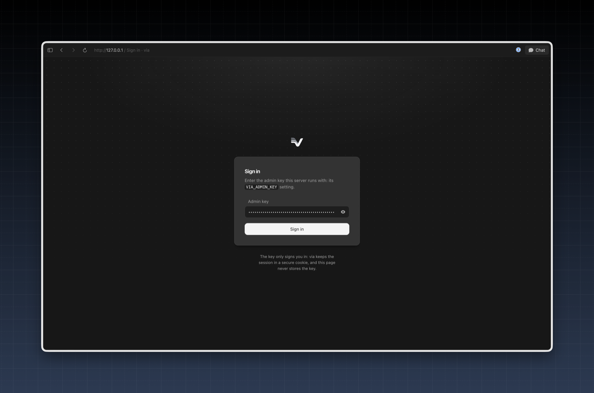
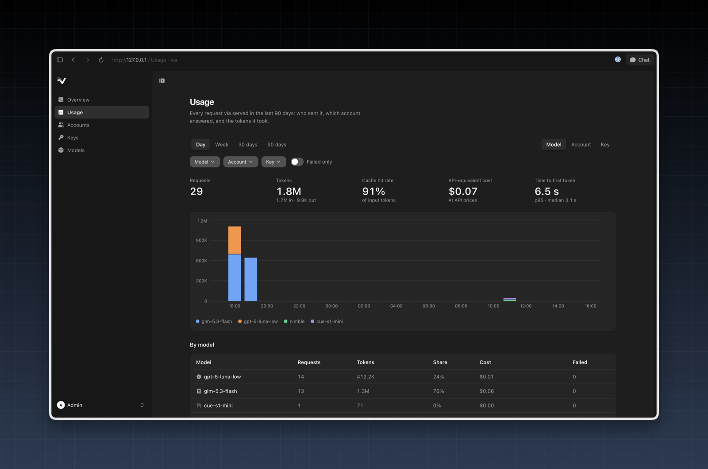
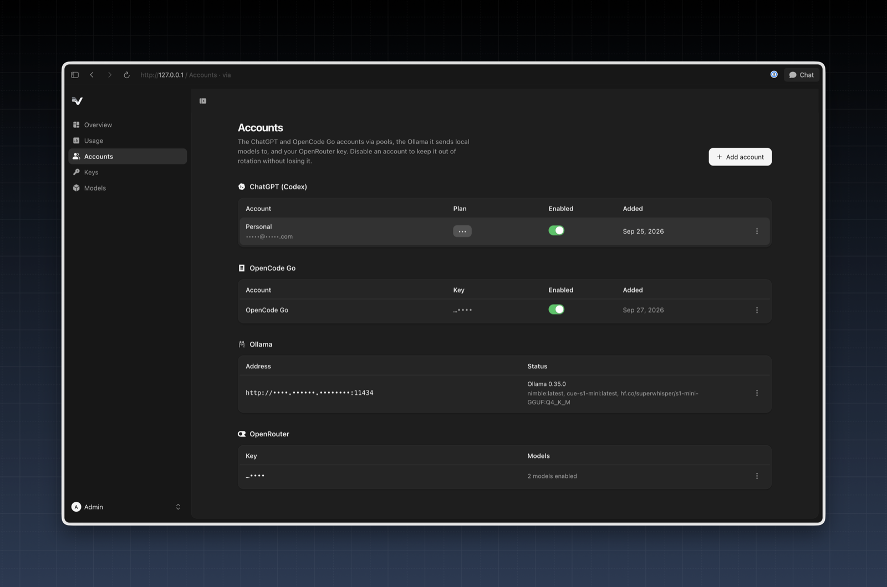
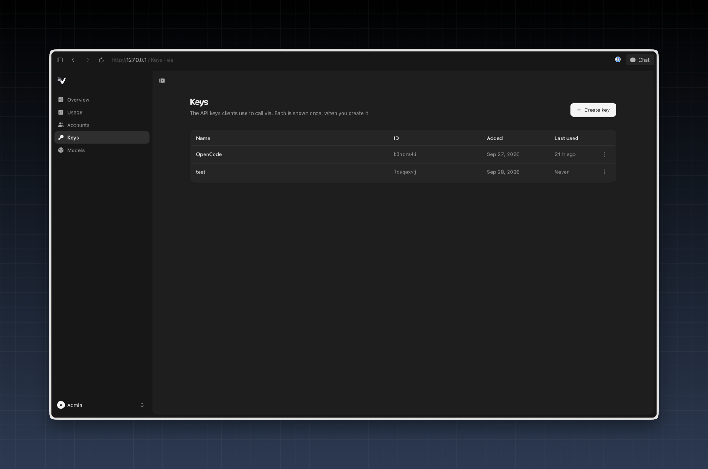
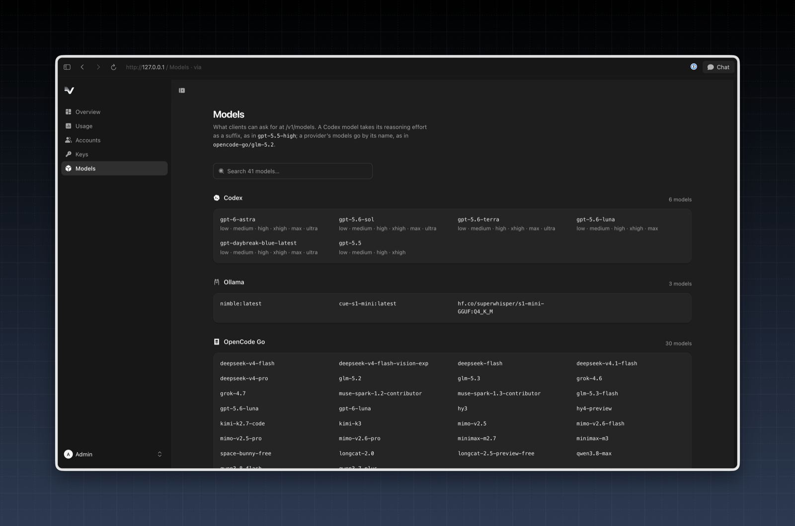
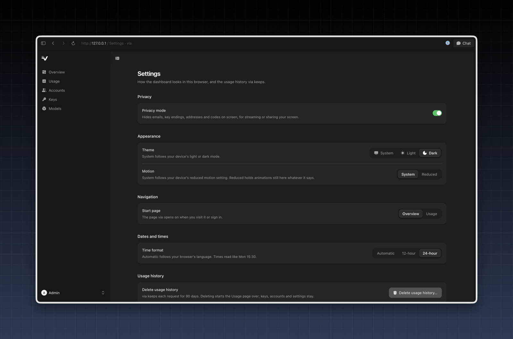

<p align="center">
  
</p>

# via

One OpenAI-compatible endpoint on your machine for your ChatGPT/Codex
subscriptions, OpenCode Go keys and other providers such as OpenRouter.

via hands out its own API keys and serves `/v1/responses`,
`/v1/chat/completions`, `/v1/models` and Ollama's `/v1/systemone` on
`127.0.0.1:8317`. Behind that it
talks to:

| Upstream                                         | How you add it                                                                                            | Models                     | When one runs out                                    |
| ------------------------------------------------ | --------------------------------------------------------------------------------------------------------- | -------------------------- | ---------------------------------------------------- |
| ChatGPT subscriptions, through the Codex backend | Device-code login: `via accounts add` or the web UI                                                       | Any model without a prefix | Pooled: via moves on to the next account             |
| OpenCode Go API keys                             | `via accounts add --provider opencode-go` or the web UI                                                   | `opencode-go/<model>`      | Pooled: via moves on to the next key                 |
| Other OpenAI-compatible providers                | An entry in [`config.yaml`](#providers); OpenRouter and Ollama also in the web UI or with `via providers` | `<provider>/<model>`       | One key each; its errors are passed back as they are |

Each request goes to the first account that still has capacity; when one hits
its rate limit, via moves on to the next (see
[How the pool picks an account](#how-the-pool-picks-an-account)).

> **Status:** early (`0.x`). Commands and file formats may still change before 1.0.

> **Risk:** pooling ChatGPT subscriptions through the Codex backend may break
> OpenAI's terms of use, and OpenAI could limit or ban the accounts. By default
> via presents itself to Codex as the Codex CLI; set `codex.cloak: false` in
> [`config.yaml`](#configuration) to send its own name instead. OpenCode Go's
> terms apply to its keys too. Use only accounts you own, at your own risk (see
> [Disclaimer](#disclaimer)).



A [web UI](#web-ui) at `/ui` shows the pool and manages accounts, keys and
models.

## Platforms

macOS and Linux, on arm64 and x64. The x64 builds use Bun's baseline target,
so they run on CPUs without AVX2 too. There is no Windows build.

## Install

Each [release](https://github.com/nkootstra/via/releases) attaches a
standalone binary for each platform, `via-<os>-<arch>` (`via-darwin-arm64`,
`via-darwin-x64`, `via-linux-arm64`, `via-linux-x64`), and a `SHA256SUMS` file.
Download yours, check it, and put it on your `PATH`; it doesn't need Bun or
Node to run:

```sh
curl -fLO https://github.com/nkootstra/via/releases/latest/download/via-darwin-arm64
curl -fLO https://github.com/nkootstra/via/releases/latest/download/SHA256SUMS
shasum -a 256 --check --ignore-missing SHA256SUMS
chmod +x via-darwin-arm64 && mv via-darwin-arm64 /usr/local/bin/via
```

`gh attestation verify via-darwin-arm64 --repo nkootstra/via` also checks that
the release workflow built it.

Prebuilt npm packages are coming: `npm i -g @nkootstra/via` will install them.
The Linux ones need glibc, so on Alpine and other musl systems use the Docker
image or build from source.
Or build from source with [Bun](https://bun.sh) 1.4:

```sh
git clone https://github.com/nkootstra/via.git
cd via
bun install
bun run --cwd apps/web build    # the web UI, which the binary embeds
cd npm && bun build.ts --host
```

That writes a standalone binary to `npm/via-<os>-<arch>/bin/via`, for example
`npm/via-darwin-arm64/bin/via`. Copy it onto your `PATH`. It doesn't need Bun
or Node to run.

## Quick start

```sh
# 1. Add an account. Repeat for each subscription you want in the pool.
via accounts add
# Open https://auth.openai.com/codex/device and enter the code <code>

# 2. Create an API key for your clients. It is shown only once.
via keys create --name laptop

# 3. Serve.
via serve
```

Point any OpenAI client at it. In another terminal, put the key `via keys create`
printed in `VIA_KEY`:

```sh
export VIA_KEY=via_...
```

```sh
curl http://127.0.0.1:8317/v1/chat/completions \
  -H "Authorization: Bearer $VIA_KEY" \
  -H "Content-Type: application/json" \
  -d '{"model": "gpt-6-astra", "messages": [{"role": "user", "content": "Hello"}]}'
```

```python
from openai import OpenAI

client = OpenAI(base_url="http://127.0.0.1:8317/v1", api_key="via_...")
reply = client.responses.create(model="gpt-6-astra-high", input="Hello")
print(reply.output_text)
```

## Docker

Each release publishes `ghcr.io/nkootstra/via` for linux/amd64 and linux/arm64,
tagged with its version (`X.Y.Z` and `X.Y`) and `latest`; from 1.0.0 on also
the major version (`X`). The examples use `latest`; to upgrade only when you
choose to, pin a version from the
[releases](https://github.com/nkootstra/via/releases) instead.

via keeps its accounts, keys, `config.yaml` and cooldowns in `/data`, so give
that a volume:

```sh
docker run -d --name via --restart unless-stopped \
  -p 127.0.0.1:8317:8317 -v via-data:/data \
  ghcr.io/nkootstra/via:latest

docker exec -it via via accounts add
docker exec via via keys create --name laptop
```

The running server picks up accounts and keys added this way without a
restart, and so does an OpenCode Go key added with
`docker exec -i via via accounts add --provider opencode-go < key.txt`. For
other [providers](#providers), put `config.yaml` in the volume and pass their
keys as environment variables. With Compose:

```yaml
services:
  via:
    image: ghcr.io/nkootstra/via:latest
    restart: unless-stopped
    ports:
      - 127.0.0.1:8317:8317
    volumes:
      - via-data:/data
    environment:
      OPENROUTER_API_KEY: ${OPENROUTER_API_KEY}

volumes:
  via-data:
```

Inside the container via listens on `0.0.0.0`; the `127.0.0.1:` in the port
mapping keeps it off other interfaces. It speaks plain HTTP, so put a TLS proxy
in front of it before exposing it any further. The image runs as a non-root
user (uid 65532) without a shell.

### In the cloud

Any host that runs a container with a persistent disk will do, such as a VPS
with Compose or a platform with volumes. What via needs from it:

- **Exactly one instance, with a persistent volume on `/data`.** Each token
  refresh replaces an account's refresh token and writes it to `/data`, so a
  second instance, or a disk that is thrown away on restart, logs the accounts
  out. That rules out scaling to more instances, and serverless hosts without
  volumes.
- **TLS in front.** Use the host's own, or a proxy such as Caddy, and send it
  to port 8317. Every `/v1` route needs one of your API keys.
- **A health check** on `GET /healthz`. It answers `200 ok` without a key and
  isn't logged.
- **Provider keys as the host's secrets**, passed as the environment variables
  `config.yaml` names. So is `VIA_ADMIN_KEY`, if you want the
  [admin API](#admin-api) and [web UI](#web-ui) instead of `docker exec`.

The image is public, so the host needs no registry login. Add accounts on the
host with `docker exec -it via via accounts add`; the
device-code login needs no browser there. Or copy an existing `~/.config/via`
into the volume, owned by uid 65532. Stop `via serve` on your machine first,
so `usage.db` and its `-wal` file are copied as one, and then stop the
container, as the image has no shell to copy with:

```sh
docker stop via
docker run --rm -v ~/.config/via:/from:ro -v via-data:/data alpine \
  sh -c 'cp -a /from/. /data/ && chown -R 65532:65532 /data'
docker start via
```

That's for Docker on the same machine, such as Docker Desktop on a Mac. For a
remote host, copy the folder there first, as with
`scp -rp ~/.config/via host:via-home`, and mount `~/via-home` there instead.
`cp -a` keeps the files at `0600`. Stop the via you copied from for good
afterwards: two vias refreshing the same accounts log each other out (see
above).

## API

Every `/v1` route needs `Authorization: Bearer <key>` with a key from `via keys create`.

| Route                       | What it does                                                                                             |
| --------------------------- | -------------------------------------------------------------------------------------------------------- |
| `POST /v1/responses`        | Passed through to Codex, or to the provider the model names.                                             |
| `POST /v1/chat/completions` | For Codex, translated to and from the Responses API, streaming included; for a provider, passed through. |
| `GET /v1/models`            | Lists the models Codex offers your accounts, then providers'.                                            |
| `POST /v1/systemone`        | Ollama's [System One](#ollama-and-system-one), passed through to the provider the model names.           |
| `GET /healthz`              | Answers `200 ok`, for health checks. Needs no key.                                                       |

A model named `<provider>/<model>`, such as `opencode-go/kimi-k3` or
`openrouter/qwen/qwen3-coder`, goes to that [provider](#providers); any other
model goes to Codex.

The Codex backend refuses sampling and limit options, so via accepts and ignores
them: `temperature`, `top_p`, `max_tokens`, `max_completion_tokens` and
`max_output_tokens`, as well as `user`, `metadata`, `previous_response_id` and
`context_management`.
A refusal comes back as the chat message's `refusal`, as OpenAI sends it.

A Chat Completions request to Codex is translated as OpenAI would read it:

- A function tool that leaves out `strict` isn't strict, as in Chat
  Completions, where the Responses API would make it strict.
- via asks Codex for reasoning summaries, and they come back as the message's
  `reasoning_content`, streamed as `reasoning_content` deltas, with a blank line
  between summary parts. Codex's encrypted reasoning isn't handed to the
  client, as Chat Completions has no field for a client to send it back in.
- A response Codex completes without reporting usage still finishes; the
  answer then has no `usage`, and a stream no usage chunk.
- A request Codex refuses gets OpenAI's error,
  `{"error":{"message","type","code"}}`, with Codex's status, message and code.
  When Codex's answer isn't readable, such as an HTML page, the message says
  only that Codex refused the request. `/v1/responses` passes Codex's refusal
  on as Codex sent it.

A provider's chat answer is passed through, with one change: some models, such
as MiniMax's on OpenCode Go, write their reasoning in a `<think>…</think>`
block at the start of the answer. via moves that block to `reasoning_content`,
where other models put their reasoning, streamed or not, so a client shows it
as reasoning rather than as the answer. A `<think>` anywhere later in the
answer is left alone.

via's server never closes a connection as idle, so an answer that goes quiet
while the model works still reaches the client, streamed or not. A streamed
answer that goes quiet also gets a `: keepalive` SSE comment every five seconds,
so a proxy in between doesn't close the connection as idle. SSE clients skip
comments. Every streamed answer also carries `cache-control: no-cache` and
`x-accel-buffering: no`, so a proxy such as nginx passes each event on as it
comes.

via bounds what one request can take:

- A request body over 64 MiB is refused with `413`, on every route. OpenAI
  takes up to 50 MB per request, images included, so anything an upstream
  would accept fits.
- Codex has 2 minutes to start answering a response, and a provider 10, as a
  provider that doesn't stream answers only once the model is done. After
  that, a stream runs as long as the model takes. An upstream that doesn't
  start in time answers `502`, like one that can't be reached.
- Once an answer has started, the upstream may go 5 minutes without sending
  anything, as long as the Codex CLI waits; a reasoning model can think for
  minutes between chunks. After that via ends its request upstream. A
  streamed answer then ends in an `upstream_incomplete` error event, as one
  the upstream broke off does, and one via collects for a client that doesn't
  stream answers `504 upstream_timeout`. A provider's answer that isn't
  streamed but passed through as it comes breaks off.
- A non-streaming Codex response that hasn't completed after 30 minutes
  answers `504 upstream_timeout`, and one whose stream runs past 128 MiB
  answers `502 upstream_too_large`.
- Usage, model lists, key checks and sign-in requests to OpenAI give up after
  30 seconds. A token refresh gives up when OpenAI hasn't started answering
  within 30 seconds; once it has, the answer gets 2 minutes to arrive, as it
  holds the new refresh token and the old one is already spent.
- A client that hangs up on a stream ends via's request upstream too.

`/v1/models` lists what the Codex model picker shows your accounts, combined,
since plans offer different models. So new models appear without a via update.
Only accounts that can serve count: enabled ones, including one cooling down,
as it serves again once its cooldown ends, but not one locked out until it
signs in again. With no such account, no Codex models are listed. via fetches
the list as it starts and answers from it at once; once it is five minutes old,
via fetches a new one in the background for the next request. Disabling,
enabling, adding or removing an account, or one being locked out, changes the
list at once. When Codex can't be asked, it lists the models via knows:
`gpt-6-astra`, `gpt-6-sol` and `gpt-6-luna`, logs a warning, and asks again
no sooner than a minute later; meanwhile any account may serve any model.

Add an effort suffix to a model id to pick the reasoning effort, as in
`gpt-6-astra-high`. The list shows each model with the suffixes it supports,
from `-none`, `-low`, `-medium`, `-high`, `-xhigh` and `-max`. A
model Codex lists under a name that already ends in one of them, such as
`gpt-5.1-codex-max`, is sent by that name, not as an alias. Other model ids are
passed through to Codex unchanged.

The Codex app also offers an `ultra` effort on some models. It is maximum
reasoning with tasks handed to agents the Codex app runs itself, and Codex's
API refuses it, so via can't serve it. via doesn't list `-ultra` ids, and
answers one with a 400 `unsupported_effort` error without asking Codex. Use
`-max` for the most reasoning via can give.

### Fallback models

A fallback rule names a model and up to three others for via to try, in
order, when that model can't serve a request. The first one that answers
does, and its answer carries `x-via-fallback: <asked> -> <answered>`, such as
`x-via-fallback: gpt-5.6-sol -> opencode-go/kimi-k3`; its body names the model
that answered. The rules are kept in `fallbacks.json` in via's
[home](#configuration):

```json
[{ "model": "gpt-5.6-sol", "fallbacks": ["opencode-go/kimi-k3", "gpt-5.5"] }]
```

A running `via serve` uses a changed file on its next request.

- **When:** only when the model can't serve before any of its answer went out.
  That is when every account that could serve it is cooling down (`429`) or
  there is none (`503`), when Codex is down or overloaded, when its upstream
  can't be reached (`502`) or a provider answers `429` or a `5xx`, when an
  OpenCode Go model speaks none of the APIs via could ask it in, and when an
  OpenRouter model isn't enabled.
- **Never:** when the upstream refuses the request itself, such as a `400` for
  a bad parameter, once an answer has started, even if it then fails, or for
  [System One](#ollama-and-system-one), whose answers belong to its model.
- **Efforts:** a rule for a Codex model covers it with any effort suffix too, so
  one for `gpt-5.6-sol` also takes `gpt-5.6-sol-high`. A Codex fallback that
  supports the effort gets it, as `gpt-5.5-high`; any other fallback is asked
  for as written. A rule for the exact id, such as `gpt-5.6-sol-high`, wins.
- **One rule:** a fallback's own rule isn't followed, and a fallback that
  refuses the request answers with that refusal.
- **None can serve:** the client gets the answer of the model it asked for,
  whose `Retry-After` is the soonest any of the models asked for.

Codex cooldowns are per account, not per model: when one Codex model can't
serve because every account is cooling down, no other Codex model can either.
A Codex model's fallback helps with a rate limit only when it is another
provider's model.

### Admin API

With `VIA_ADMIN_KEY` set, `via serve` also serves `/admin`, which does what the
`via accounts` and `via keys` commands do, over HTTP. Without it, `/admin`
doesn't exist and answers 404. The key must be at least 32 characters, or
`via serve` refuses to start; `openssl rand -hex 32` makes one.

Every `/admin` route needs `Authorization: Bearer <VIA_ADMIN_KEY>` or a
session cookie from [signing in](#signing-in-from-a-browser), except signing in
itself and the API's description: its OpenAPI spec at `/admin/openapi.json` and
a reference page at `/admin/docs`, where you can also try the routes out. API
keys from `via keys create` don't work on `/admin`, and the admin key doesn't
work on `/v1`.

| Route                                     | What it does                                                                                            |
| ----------------------------------------- | ------------------------------------------------------------------------------------------------------- |
| `POST /admin/session`                     | Sign in with `{"key": "<VIA_ADMIN_KEY>"}`; sets a cookie.                                               |
| `GET /admin/session`                      | 200 while signed in, else 401.                                                                          |
| `DELETE /admin/session`                   | Sign out.                                                                                               |
| `GET /admin/accounts`                     | List accounts in the order they are used, without tokens.                                               |
| `PATCH /admin/accounts/<id>`              | Change `label` and/or `enabled`; returns the account.                                                   |
| `DELETE /admin/accounts/<id>`             | Forget an account and delete its tokens.                                                                |
| `POST /admin/accounts/logins`             | Start a device-code login.                                                                              |
| `GET /admin/accounts/logins/<id>`         | Check on a login: `pending`, `added`, `updated` or `failed`.                                            |
| `GET /admin/opencode-go/accounts`         | List OpenCode Go keys, each only by its last four characters.                                           |
| `POST /admin/opencode-go/accounts`        | Add a key from `{"apiKey": "...", "label": "..."}` (label optional), once OpenCode Go accepts it.       |
| `PATCH /admin/opencode-go/accounts/<id>`  | Change `label` and/or `enabled`; returns the key's account.                                             |
| `DELETE /admin/opencode-go/accounts/<id>` | Forget an OpenCode Go key.                                                                              |
| `GET /admin/ollama`                       | Where [Ollama](#ollama-and-system-one) is: `{"address", "fromConfig"}`, or `null`.                      |
| `PUT /admin/ollama`                       | Save Ollama's address from `{"address": "..."}`; via sends to it at once. `409` if config.yaml sets it. |
| `DELETE /admin/ollama`                    | Forget the saved address. `409` if config.yaml sets it.                                                 |
| `POST /admin/ollama/check`                | What `{"address": "..."}` holds: `{"address", "version", "models"}`, or `422` and why not.              |
| `GET /admin/openrouter`                   | OpenRouter's key, masked, and the models it enables: `{"key", "models", "fromConfig"}`, or `null`.      |
| `PUT /admin/openrouter/key`               | Save `{"apiKey": "..."}` once OpenRouter accepts it; `422` if it refuses. `409` if config.yaml sets it. |
| `PUT /admin/openrouter/models`            | Offer exactly `{"models": [...]}` of OpenRouter's, by id.                                               |
| `DELETE /admin/openrouter`                | Forget the key and its models. `409` if config.yaml sets it.                                            |
| `GET /admin/openrouter/catalog`           | Every model OpenRouter lists, with its prices per million tokens and context length.                    |
| `GET /admin/usage`                        | How much of each account's limits is used.                                                              |
| `GET /admin/history/series`               | Tokens per hour or day, by group (see [Usage history](#usage-history)).                                 |
| `GET /admin/history/breakdown`            | Requests, tokens, failures, latency and cost over a range, by group.                                    |
| `GET /admin/history/requests`             | The requests in a range, newest first, a page at a time.                                                |
| `DELETE /admin/history`                   | Delete the whole usage history; answers `{"deleted": <count>}`.                                         |
| `GET /admin/pool`                         | Each account's and provider's state (see below).                                                        |
| `GET /admin/models`                       | The models `/v1/models` lists.                                                                          |
| `GET /admin/events`                       | The admin state as server-sent events, as it changes, and when the usage history changes.               |
| `GET /admin/keys`                         | List API keys and when each was last used, not the keys.                                                |
| `POST /admin/keys`                        | Create a key from `{"name": "..."}`. It is returned once.                                               |
| `PATCH /admin/keys/<id-or-name>`          | Rename a key from `{"name": "..."}`; the key stays the same.                                            |
| `DELETE /admin/keys/<id-or-name>`         | Revoke a key.                                                                                           |

Accounts are named by their `id` from `GET /admin/accounts`. Unlike the
commands, the admin API doesn't take a label or email, which would otherwise
end up in URLs and access logs. An account, login or key that doesn't exist
answers 404; a key name that is taken
answers 409. A name or label over 200 characters, or a key over 1,024,
answers 400.

A key's `lastUsedAt` is `null` until a client first uses it. `via serve` knows
it to the second, but writes it to `keys.json` at most once a minute per key
rather than on every request, so after a restart, or in `via keys list` next
to a running `via serve`, it can be up to a minute behind.

Before it keeps an OpenCode Go key, via asks OpenCode Go for the key's usage:
a key OpenCode Go refuses answers 422, one via can't check because OpenCode Go
is down answers 502, and one via already has answers 409. The key is never
answered back: `key` is its last four characters, as `…abcd`, and the account
imported from the deprecated `apiKeyEnv` variable has `environmentVariable`
set to that variable's name while it is still set.

To add an account, start a login, open `verificationUrl` and enter `userCode`,
then poll the login until it's no longer `pending`:

```sh
curl -X POST -H "Authorization: Bearer $VIA_ADMIN_KEY" http://127.0.0.1:8317/admin/accounts/logins
# {"id":"<id>","userCode":"ABCD-1234","verificationUrl":"https://auth.openai.com/codex/device"}

curl -H "Authorization: Bearer $VIA_ADMIN_KEY" http://127.0.0.1:8317/admin/accounts/logins/<id>
# {"status":"added","account":{"id":"...","label":"you@example.com",...}}
```

A login fails if it isn't approved within 15 minutes. At most 10 logins can
wait for approval at once; starting another answers 429 until one ends. Logins
are kept in memory, so restarting via cancels them, and one that has ended is
forgotten 5 minutes later, when polling it answers 404.

`GET /admin/pool` answers `{"accounts": [...], "opencodeGo": [...], "providers": [...]}`.
It lists every ChatGPT account, and in `opencodeGo` every OpenCode Go account,
with its `id`, `label`, `enabled` and a `state`:
`{"status":"available"}`, `{"status":"cooling","until":"<ISO time>","reason":"..."}`
while Codex has it rate-limited, or `{"status":"auth_error","reason":"..."}` once
Codex rejects its tokens even after a refresh, until you log in to it again (for
an OpenCode Go account, once OpenCode Go refuses its key, until via restarts). A
disabled account keeps its state but isn't used.

Next to the accounts it lists every configured provider with its own key, such
as OpenRouter, with its `name` and `{"status":"available"}`: requests for
`<provider>/<model>` go straight to it.

`GET /admin/usage` answers `{"accounts": [...], "opencodeGo": [...], "openrouter": ..., "refreshing": ...}`
at once from the usage via last fetched, never waiting on ChatGPT or OpenCode
Go. An OpenCode Go account's windows are named as OpenCode Go names them, such
as `rolling`, `weekly` and `monthly`. `openrouter` is the OpenRouter key's
budget, as OpenRouter tells it: `{"budget": {"limitUsd", "spentUsd", "window",
"resetsAt"}}`, with `budget` `null` for a key without a limit, or `{"error"}`;
it is `null` while via has no OpenRouter key. A budget resets daily, weekly
(Monday) or monthly at midnight UTC, or never (`window` and `resetsAt` `null`). via fetches every account's usage in the
background: when it starts, every 15 minutes after that, and whenever an answer
would be a minute old or more, or would miss an account. So what you see is at
most about a minute old, and via asks for each account's usage at most once a
minute however often the page refreshes. Each entry in `GET /admin/usage` says when it was fetched
(`fetchedAt`), an account via has no usage for yet is left out, and
`refreshing` is `true` while a fetch runs.

`GET /admin/events` is a stream of
[server-sent events](https://html.spec.whatwg.org/multipage/server-sent-events.html)
that pushes the admin state instead of making you poll. Each event is named
`state` and carries all of it as JSON: `pool` and `usage` as the routes above
answer them, `accounts`, `opencodeGo` (keys masked) and `keys` as their lists
do, `models`, `version` (the running via's) and `session: true`. The first
comes as soon as you connect; after that, one comes whenever something in it
changes: an account, OpenCode Go key or API key is added, changed or removed,
an API key is used for the first time in a minute, a cooldown or lockout starts
or is lifted, a cooldown runs out, or a usage fetch starts or ends. Changes
that come together (within about 200 ms) arrive as one event, and a state the
same as the last one isn't sent again. A `: keepalive` comment keeps a quiet
stream open. Changes another process makes, such as `via accounts label`,
show within 15 seconds, and while a stream is open via keeps usage from
getting more than about a minute old, as it does for a page that polls.
A stream opened with a session cookie ends when that session does: on sign-out,
12 hours after sign-in, or after an hour unused. An open stream doesn't count
as using the session, so a page left open with nothing done in it is signed out
on the hour as one that polls would be. A stream opened with the bearer key
runs until you close it.

The stream also says when the [usage history](#usage-history) changes, as when
via keeps a request or the history is deleted, with an event named `history`
and nothing more in it: the history is too big to send, so you fetch what you
show from `/admin/history`. Changes within a second of each other arrive as one
event.

#### Signing in from a browser

A browser signs in once with the admin key, and from then on sends a session
cookie instead, so the key is never kept in the page:

- `POST /admin/session` with `{"key": "<VIA_ADMIN_KEY>"}` answers 204 and sets
  `via_session`, an `HttpOnly`, `SameSite=Strict` cookie for the whole
  site (`Path=/`), so loading the web UI at `/ui` sends it too. The cookie
  is `Secure` when the browser signed in over HTTPS, which via tells from the
  request's `Origin` header, so a proxy that ends TLS in front of via needs
  no setting for it.
- Browsers keep cookies by host, not by port, so the browser also sends
  `via_session` to every other service on via's host, such as another app on
  `localhost:3000`, and `SameSite=Strict` doesn't stop it: to a browser, every
  port on a host is the same site. Any such service can read the cookie and
  act as the admin until the session ends. Serve the web UI from a host name
  of its own, or sign out when you're done.
- A session ends 12 hours after sign-in, after an hour unused, on
  `DELETE /admin/session`, or when via restarts; sessions are kept in memory.
- A request that changes something (anything but `GET`) with only the cookie
  must send `x-via-csrf: 1` and an `Origin` whose host is the `Host` it was
  sent to; otherwise it answers 403. A proxy in front of via must pass the
  `Host` header through unchanged. Requests with the bearer key need neither.
- A wrong key answers 401 after a one-second delay. After 10 wrong keys
  within a minute from one address, sign-ins from that address answer 429,
  after the same delay, until the minute has passed, even if the right key was
  used in between; other addresses can still sign in. After 1000 wrong keys within a minute from all addresses together,
  every sign-in answers 429, which keeps many addresses guessing at once from
  getting far. The address is the connection's: via ignores `X-Forwarded-For`
  and similar headers, so behind a proxy every sign-in shares the proxy's
  address. Each failed sign-in is logged, without the key. via never logs the
  key or the cookie.
- A wrong `Authorization: Bearer` key on any `/admin` route counts as a failed
  sign-in from its address too, and is logged the same way, though it answers
  401 at once. While an address's sign-ins answer 429, so do its bearer
  requests, even with the right key; sessions already signed in keep working.

### Web UI

With `VIA_ADMIN_KEY` set, `via serve` also serves a web UI for the admin API
at `/ui/`, such as `http://127.0.0.1:8317/ui/`. Without the key it answers 404,
as `/admin` does. It's built into the binary and the Docker image, so there is
nothing else to run or download, and it loads nothing from other sites.

#### Pages

**Overview** shows how the pool stands right now: how many accounts and
providers are available, cooling down, locked out or disabled, and how much of
each one's limits is used.


<details>
<summary><b>Sign in</b>: enter the admin key once; via keeps the session in a cookie.</summary>



</details>

<details>
<summary><b>Usage</b>: requests, tokens, cache hit rate, cost and time to first token, charted and broken down by model, account or key.</summary>



</details>

<details>
<summary><b>Accounts</b>: the ChatGPT and OpenCode Go accounts in the pool, your Ollama and your OpenRouter key; add, disable or remove them.</summary>



</details>

<details>
<summary><b>Keys</b>: the API keys your clients use to call via; create, rename and revoke them.</summary>



</details>

<details>
<summary><b>Models</b>: every model clients can ask for at <code>/v1/models</code>, grouped by upstream and searchable.</summary>



</details>

<details>
<summary><b>Settings</b>: privacy mode, theme, motion, start page and time format, and deleting the usage history.</summary>



</details>

#### Using it

Open it and sign in with the admin key. The page [signs in](#signing-in-from-a-browser)
as above: it keeps only the session cookie, never the key, and a reload or a
link to any page keeps you signed in until the session ends. From there you can
see the pool at a glance, add ChatGPT accounts by device-code login or OpenCode
Go keys by pasting them, rename, disable and remove them, create, rename and revoke API
keys, and list the models. The Accounts page lists the ChatGPT accounts under
Codex and the OpenCode Go keys under their own heading, each key only by its
last four characters. Its Ollama section adds, changes or removes the
address of your Ollama, and shows the version and models via finds there.
Its OpenRouter section takes your OpenRouter key and chooses which of its
models via offers. The Models page shows each model once: a Codex model
with the reasoning efforts its suffixed ids pick, and a provider's models under
its heading without their `<provider>/` prefix. Search matches every id.

**Settings**, in the menu under **Admin** at the foot of the sidebar, holds the
page's preferences:

- **Privacy mode**, for streaming or sharing your screen: it hides emails
  (in labels and error messages too), key endings, the OpenRouter key, the
  Ollama address and the ChatGPT plan, and shows a new API key or a sign-in
  code as dots until you choose **Show** (**Copy** copies it either way).
  Renaming an account whose label it hides starts from an empty field. It
  changes only what the page shows; the admin API answers as always.
- The theme (System, Light or Dark), and **Motion**: System follows the
  device's reduced motion setting, Reduced holds animations still whatever it
  says.
- The time format (Automatic, 12-hour or 24-hour).
- The **Start page**: Overview or Usage, which the page opens on when you
  visit it or sign in.

It also deletes the whole
[usage history](#usage-history), after asking; that one isn't a preference of
the browser, so it's gone for every viewer. Automatic writes times as the browser's
language does. Each choice applies at once, to every open tab, and is kept in
that browser's local storage, not in via, so another browser starts from the
defaults.

The **Usage** page shows the [usage history](#usage-history): requests,
tokens, cache hit rate, API-equivalent cost and time to first token (of
streamed answers that didn't fail) over the
last day, week, 30 or 90 days; tokens per hour or day, stacked by model,
account or key; a table of each; and the requests themselves, newest first.
Filter the whole page to one model, account or key, and to failed requests
only: pick them from the filter bar, where each one's search lists what the
other filters leave with its request count, or pick a row of the table. The
range, grouping and filters are in the page's address, as in
`/ui/usage?range=7d&model=opencode-go/kimi-k3&failed=true`, so a reload keeps
them and a link shares them. A request shows up within about a second: the
page fetches its usage again when via says the history changed, and asks every
15 seconds only while that stream is down.

The overview shows each account's usage as via last fetched
it in the background (see [the admin API](#admin-api)), at most about a minute
old, and says how long ago that was. OpenRouter's card shows its key's budget
as a meter, like an account's limits, when the key has a limit. A provider
reports no usage of its own, so its card shows what via counted of its
requests over the last 24 hours:
requests, tokens and cost (Free for a local one such as Ollama), with a link
to them on the Usage page. The overview fetches those figures once it has
painted.

The page shows the pool as it is right now, without reloading or polling. When
a signed-in browser opens or reloads it, via puts the current state in the
page itself, so it paints straight away without asking `/admin` for anything.
The page then listens to [`GET /admin/events`](#admin-api), and a cooldown,
a lockout, new usage or a change made in another tab shows up the moment via
knows it. If that stream drops, the page asks every few seconds instead until
the browser reconnects. The state in the page is the viewer's, so via tells
browsers and proxies not to cache it.

When via restarts on a new version while the page is open, the page
reconnects, notices that it was built for the old one, and says "via was
updated. Reload to get the new version." until you reload it.

The page is the admin key's reach in a browser, so give it the same care:

- Keep via on `127.0.0.1`, as it is by default, or put it behind TLS before
  you open it anywhere else. Over plain HTTP the key and the cookie cross the
  network readable.
- The page runs only via's own code: its Content Security Policy allows
  scripts, styles and requests from via alone, and it can't be framed by
  another site.

## Commands

| Command                                        | What it does                                                    |
| ---------------------------------------------- | --------------------------------------------------------------- |
| `via accounts add`                             | Log in to a ChatGPT account with a device code.                 |
| `via accounts add --provider opencode-go`      | Add an OpenCode Go API key as an account.                       |
| `via accounts list`                            | List accounts in the order they are used.                       |
| `via accounts status`                          | Show each account's and provider's limits and how much is used. |
| `via accounts label <account> <label>`         | Rename an account.                                              |
| `via accounts disable <account>`               | Stop using an account without removing it.                      |
| `via accounts enable <account>`                | Use it again.                                                   |
| `via accounts remove <account>`                | Forget an account and delete its tokens.                        |
| `via providers openrouter set-key`             | Add or replace the OpenRouter API key.                          |
| `via providers openrouter models [<model>...]` | Offer exactly these OpenRouter models, by id.                   |
| `via providers openrouter remove`              | Forget the OpenRouter key and its models.                       |
| `via providers ollama set <address>`           | Add Ollama at `<address>`, or change its address.               |
| `via providers ollama remove`                  | Forget Ollama's address.                                        |
| `via keys create --name <name>`                | Create an API key. It is printed once.                          |
| `via keys list`                                | List keys, when each was created and when it was last used.     |
| `via keys rename <id-or-name> <new-name>`      | Rename a key; clients keep using it.                            |
| `via keys revoke <id-or-name>`                 | Revoke a key.                                                   |
| `via serve [--host <addr>] [--port <n>]`       | Serve the API in the foreground.                                |

`<account>` matches an account's id, label or email.

A running `via serve` sees what these commands change from its next request
on: a revoked key is refused and a disabled account is skipped once the command
has finished. It keeps the accounts and keys in memory and checks each request
whether their files changed (`stat`, no read), reading them again only then.

Adding a ChatGPT account that is already in the pool signs it in again: via
replaces its tokens and keeps its label and whether it's enabled, rather than
adding it twice. Adding an OpenCode Go key via already has is refused.

`via accounts add --provider opencode-go` asks for the key without echoing it,
or reads it from standard input when that isn't a terminal, so a script can
pipe it in: `via accounts add --provider opencode-go < key.txt`. It never takes
the key as an argument, which would end up in your shell history. Like the web
UI, it asks OpenCode Go whether the key works first, and keeps it only if
OpenCode Go takes it: a key OpenCode Go refuses, or one it can't check because
OpenCode Go can't be reached, isn't stored, and the command exits with `1` and
says why. `list` and `status` show only a key's last four characters.

`via accounts status` asks every configured provider at once whether it can be
used, as the web UI does: Ollama for its version, OpenRouter about its key, and
any other provider for its models, each for up to 30 seconds. Its line ends in
`available`, `key refused (HTTP <status>)` or `unavailable: <reason>`.
`status` only reads: it changes no account or file.

`via providers` sets up OpenRouter and Ollama as the web UI does, and keeps
them in the same files. `openrouter set-key` reads the key as
`accounts add --provider opencode-go` does, checks it with OpenRouter first,
and keeps the models chosen before; a key OpenRouter refuses, or one it can't
check, isn't stored. `openrouter models` takes the models' OpenRouter ids,
such as `openai/gpt-5`; with none, it offers none. `ollama set` keeps the
address even when nothing answers there yet, and says what it finds. Neither
changes a provider config.yaml sets up. A running `via serve` sees these
changes only once it restarts.

## How the pool picks an account

- Accounts are used **fill-first**, in the order you added them: via stays on
  the first account until it can't serve a request.
- A conversation stays on the account that last answered it, so its prompt
  cache stays warm, as long as that account is still available; a new
  conversation, or one whose account failed over, uses fill-first. This is
  kept in memory only, capped at 10,000 conversations, and forgotten after an
  hour of inactivity.
- Plans differ, so a model goes only to accounts whose model list includes it,
  such as `daybreak` or `daybreak-high` to the one account that offers
  `daybreak`. A model no account's list includes is tried on every account
  anyway, as it may be newer than the list.
- A rate-limit or usage-limit answer puts that account on a cooldown until the
  reset time the upstream gives or its `Retry-After` (seconds or a date),
  whichever is later, or 30 minutes if it gives neither, and via retries
  on the next account. Codex's reset time is the error's `resets_at`, else its
  `resets_in_seconds`, else the `x-codex-primary-reset-at` or
  `x-codex-secondary-reset-at` header of the window that is used up. Codex
  sometimes starts a response and then fails it with a rate or usage limit
  (`response.failed`); that counts the same. A client that isn't streaming
  gets its answer from the next account; a streaming client has already been
  sent the start of the response, so it gets the failure, and the next request
  goes to the next account.
- A server error (5xx) or an overloaded Codex is an outage, not the account's
  fault: via cools no account down and doesn't try the others, which would
  meet the same outage. The client gets `503` if Codex is overloaded, else
  `502`, as an OpenAI error, with Codex's `Retry-After` when it sends one.
- A 401 makes via refresh the account's token and retry once. If that fails, the
  account is locked out: taken out of use until it signs in again. Sign it in
  from the web UI's **Add account** and it's back in rotation at once. With
  `via accounts add` instead, restart `via serve`: the CLI can't reach the
  running server's lockouts. A login lifts only a lockout, never a cooldown.
- A 403 means Codex bars the account (suspended, its workspace deactivated, or
  blocked by Cloudflare): via cools it down for 30 minutes and tries the next
  one. A 403 for a request Codex's policy refuses
  (`misalignment_policy_violation`) goes back to the client as-is.
- A Codex backend via can't reach at all answers `502` without trying the next
  account. A token refresh that fails because the sign-in server can't be
  reached, or because its file in `auth/` stays locked by another via process
  for 3 minutes, or is corrupt or unreadable, rests that account for 1 minute, and via tries the
  next one; an account removed meanwhile is skipped. Only a refused refresh
  locks an account out.
- One via process refreshes an account at a time, so `via accounts status` next
  to a running `via serve` never spends a refresh token twice. If the new
  tokens can't be saved (a full disk, say), via keeps them in memory and saves
  them the next time it uses the account; they are lost if via stops first.
- When no account is left, the client gets `429` with a `Retry-After` header
  (or `503` if waiting won't help). For a model only some accounts offer, only
  those accounts count.
- Running cooldowns are saved in `state.json`, so a restarted `via serve` keeps
  them. Lockouts aren't saved: a restart gives a locked-out account one more try.
- In the background, via also asks ChatGPT for each account's usage when it
  starts and every 15 minutes after that, a few accounts at a time, so an
  already-exhausted account cools down before its next request would hit a 429. The web UI shows the same usage. This never ends a cooldown early, only starts one or
  extends it to a later reset that ChatGPT has confirmed.

OpenCode Go accounts, for `opencode-go/` models, make a pool of their own that
works the same way: fill-first in the order you added the keys, a conversation
kept on the key that last answered it, and a `429` (or every key resting)
handled as above. A key's cooldown lasts until its used-up usage window resets,
or as long as the answer's `Retry-After` asks, whichever is later. via doesn't
wait for the usage before trying the next key: the key rests at once for its
`Retry-After`, or 1 minute without one, while via asks its usage in the
background and then lengthens the cooldown to match. A key OpenCode Go refuses
or forbids (401 or 403) is taken out of use until `via serve` restarts. via
asks OpenCode Go for each key's usage every 15 minutes too.

When no account can serve a request, a [fallback rule](#fallback-models) can
send it to another model instead of answering `429` or `503`.

## Configuration

via keeps everything in `~/.config/via`, or in `$VIA_HOME` if it's set and not empty.

| File               | Contents                                            |
| ------------------ | --------------------------------------------------- |
| `config.yaml`      | Optional settings; you write it, via only reads it. |
| `keys.json`        | Your API keys' SHA-256 hashes and last use.         |
| `auth/<id>.json`   | One account's OAuth tokens.                         |
| `state.json`       | Running cooldowns; safe to delete.                  |
| `opencode-go.json` | Your OpenCode Go API keys, as accounts.             |
| `ollama.json`      | The address of the Ollama added in the web UI.      |
| `openrouter.json`  | Your OpenRouter API key and the models it enables.  |
| `fallbacks.json`   | Your [fallback models](#fallback-models).           |
| `usage.db`         | The [usage history](#usage-history), in SQLite.     |

An `auth/<id>.json` via can't read is skipped with a warning naming it, so the
other accounts keep working. Delete it and sign that account in again.

`config.yaml`, with the defaults:

```yaml
host: 127.0.0.1
port: 8317
codex:
  # Present requests to Codex as the official Codex CLI; false sends via's own name.
  cloak: true
```

`via serve --host` and `--port` override the file. via refuses a key it doesn't
know, at any level, such as a misspelt `prot:` or `apiKeyENV:`, and names it.

### Model prices

The [usage history](#usage-history) prices tokens with a snapshot of two
price tables that ships with via: [models.dev](https://models.dev) for what
OpenCode Go charges for each of its models, and
[LiteLLM's](https://github.com/BerriAI/litellm/blob/main/model_prices_and_context_window.json)
for the rest. The snapshot's header says on which day it was taken, and from
which commit of LiteLLM's table. For a model neither lists, or at another price, add it under
`prices`, in USD per million tokens. `cachedInput` and `cacheWrite` are
optional: input read from the cache, and input written to it, cost what other
input does unless they're set. A price that grows past a long context
is taken at its base rate.

```yaml
prices:
  opencode-go/kimi-k3:
    input: 0.6
    cachedInput: 0.1
    cacheWrite: 0.75
    output: 2.5
```

A model is looked up as it's asked for, then without its `<provider>/` prefix,
then without a reasoning-effort suffix such as `-high`, ignoring case; a price
in `config.yaml` wins over the snapshot at each step.

### Providers

Add OpenAI-compatible providers under `providers`. Each one reads its API key
from the environment variable `apiKeyEnv` names; `via serve` won't start while
that variable is unset. A provider without `apiKeyEnv`, such as a model server
on your own machine, is sent no key. OpenRouter still needs one: from
`apiKeyEnv`, or from the web UI or `via providers` (see [OpenRouter](#openrouter)).

OpenCode Go is the exception: it needs no entry at all. Add its keys as
accounts with `via accounts add --provider opencode-go`, and via pools them
like ChatGPT accounts (see [How the pool picks an account](#how-the-pool-picks-an-account)).

> **Deprecated:** reading OpenCode Go's key from `apiKeyEnv` (such as
> `OPENCODE_API_KEY`). While that variable is set, `via serve` adds its key as
> an account named `OpenCode Go (imported)`, once, and logs a warning at
> startup. Until then, `via accounts status` shows the key by the variable's
> name.
> Remove the variable (and the `opencode-go` entry, unless you set its
> `baseUrl` or `sessionHeader`); a later release stops reading it.

```yaml
providers:
  openrouter:
    apiKeyEnv: OPENROUTER_API_KEY
  # Ollama needs no key, and is looked for at http://localhost:11434/v1.
  ollama: {}
  # Any other OpenAI-compatible endpoint needs its baseUrl.
  vllm:
    baseUrl: http://gpu-box:8000/v1
    apiKeyEnv: VLLM_KEY
    # Optional: the header the provider reads a session id from.
    sessionHeader: x-session-id
```

#### OpenRouter

Add your OpenRouter API key on the Accounts page of the [web UI](#web-ui). via
checks it with OpenRouter first, then keeps it in `openrouter.json`, and shows
it only by its last four characters. OpenRouter lists hundreds of models, so
none is offered until you choose some: **Choose models…** in its row lists
them all, with OpenRouter's prices, to search and switch on. A model whose
price OpenRouter doesn't fix, such as `openrouter/auto`, which costs what the
model it routes to does, shows "Price unknown". Only those show
in `/v1/models`; a request for another answers `404` (`model_not_found`),
saying to enable it. Replacing the key keeps the models chosen. It all takes
effect at once, with no restart.

`via providers openrouter set-key` and `via providers openrouter models` do the
same from the command line (see [Commands](#commands)); `via serve` uses what
they save once it restarts.

An `openrouter` entry in config.yaml with `apiKeyEnv` wins: the web UI shows
its key, and via offers every model OpenRouter lists. One without `apiKeyEnv`
only moves where the web UI's key is sent, with `baseUrl` or `sessionHeader`.

#### Ollama and System One

Add Ollama on the Accounts page of the [web UI](#web-ui): give its address,
such as `http://192.168.1.20:11434`, and via sends to it at once, with no
restart. The page shows the Ollama version there and its models, and changes
or removes the address later. via keeps it in `ollama.json`.
`via providers ollama set <address>` saves it from the command line, for
`via serve` to use once it restarts.

Or set it up in config.yaml, which then wins: the web UI shows that address
but leaves changing it to config.yaml. With `ollama: {}`, via uses the Ollama
on the same machine, and lists its local models as `ollama/<model>`, such as
`ollama/llama3.2`. When Ollama runs somewhere else, give its address as
`baseUrl`, ending in `/v1`:

- on another machine: `baseUrl: http://192.168.1.20:11434/v1`, with Ollama
  listening beyond its own machine (`OLLAMA_HOST=0.0.0.0`);
- when via runs in Docker and Ollama on the host:
  `baseUrl: http://host.docker.internal:11434/v1` (Docker Desktop), as
  `localhost` in the container is the container itself.

Ollama's [System One](https://docs.ollama.com/api/systemone) answers choice,
yes/no and scoring questions about a state with a local model such as
`nimble`, and needs Ollama 0.35.0 or later. via serves it at
`POST /v1/systemone` with the same body, the model prefixed:

```sh
curl http://127.0.0.1:8317/v1/systemone \
  -H "Authorization: Bearer $VIA_KEY" \
  -d '{"model": "ollama/nimble", "state": "Checkout has returned 500s since 9am.",
       "questions": {"label": {"type": "choice", "instructions": "Which label fits?",
       "criteria": {"billing": "Payments", "bug": "Software errors"}}}}'
```

It goes to the provider the model names, as it is, and is kept in the
[usage history](#usage-history) like any other request. A local model's tokens
are counted there, but cost nothing. A model with no
provider prefix, which would go to Codex, is refused with `400`.

Prefix a model with the provider's name to use it, as in
`openrouter/qwen/qwen3-coder` or `opencode-go/kimi-k3`. via passes
`/v1/chat/completions` and `/v1/responses` requests on as they are, with only
the prefix taken off the model, and passes the provider's answer back the same
way, errors included. Of the answer's headers, the client gets its
`content-type`, `Retry-After` and `x-ratelimit-*` ones. A streamed answer the
provider breaks off ends in an `upstream_incomplete` error, as an event of
the API the client asked in.

Of the client's request headers, via passes on only those a provider may act
on: `anthropic-beta`, `anthropic-version`, `openai-beta`, and OpenRouter's
`http-referer` and `x-title`. A Messages request goes out with the client's
`anthropic-version`, or `2023-06-01` without one. Every other header,
`authorization`, cookies and `host` included, stays with via, which sends the
provider its own key.

OpenCode Go serves each model in one API of its own choosing: Chat
Completions, the Responses API, or Anthropic's Messages, and refuses a
request in another with `ModelProtocolUnsupported`. For a
`/v1/chat/completions` request, via then asks again in the next of those,
translating the request and the answer, streamed or not, tool calls and
usage included, and remembers which one the model answered in, so later
requests go straight there. A restart forgets, at the cost of one refused
request per model. A `/v1/responses` request still goes only as it came, so
a model OpenCode Go serves only in Chat Completions or Messages refuses it.

`/v1/models` lists every provider's
models with their prefix and the details the provider gives, such as
`context_length`; a provider that can't be reached is left out, as is OpenCode
Go while none of its accounts is enabled.

To keep a conversation on a warm prompt cache, via gives each request a session
id: the one the client sent, in `x-parent-session-id` (so OpenCode's sub-agents
share their parent's), `x-opencode-session`,
`x-claude-code-session-id`, `session-id`, `session_id`, `x-session-id`, the
body's `session_id` or `prompt_cache_key`, `x-task-id` or `x-kilocode-taskid`;
otherwise one derived from the conversation's first system and user message.
OpenCode Go gets it in `x-opencode-session`, OpenRouter in the body's
`session_id` and, unless the client set one, `prompt_cache_key`, and Codex in
its `session_id` header.

OpenCode also writes its session id into the `<env>` block of its system
prompt, which would keep its sub-agents from sharing a prompt cache with each
other and their parent. via moves that one line, for Chat Completions, to the
start of the first user message; the model still sees it.

### Logs

`via serve` logs one line per request once its answer has been sent, as
`key=value` pairs:

```
timestamp=2026-09-25T16:32:34.464Z level=INFO fiber=#27 message="Sent HTTP response" request_id=592f9436-3ad2-4e0f-a239-d4803bdb9925 http.span=3607ms http.method=POST http.url=/v1/chat/completions http.status=200 key=laptop model=opencode-go/deepseek-v4.1-flash served_by=go-work input_tokens=812 output_tokens=194 headers_ms=2712 first_chunk_ms=3433 stream_end=completed
timestamp=2026-09-25T16:32:37.464Z level=INFO fiber=#28 message="Sent HTTP response" request_id=2a374005-22ec-40ed-a5e5-1dfa5aa6a807 http.span=5ms http.method=POST http.url=/v1/chat/completions http.status=429 key=laptop model=gpt-6-astra error=rate_limit_exceeded retry_after=120
```

- `request_id` correlates the line to the request: the client's `x-request-id`
  header, kept when it's a valid UUID (lower-cased), else one via generates.
  via echoes it back as `x-request-id` on every response, and stamps it on any
  warning logged while handling the request (a cooldown, say), even across a
  retry onto another account.
- `http.span` is the whole time via took, a stream included.
- `key` is the name of the API key the client used, `model` the model asked
  for, and `served_by` the provider, or the Codex or OpenCode Go account, that
  answered. When a [fallback](#fallback-models) answered, `model` is the
  fallback, `requested_model` the model asked for and `fallback_reason` why it
  couldn't serve, such as `rate_limit_exceeded`; an `INFO` line before it says
  which model was asked instead, and why.
- `input_tokens` and `output_tokens` are the token counts the upstream
  reported for an answered request, and `cached_tokens` joins them when the
  upstream reports a cache hit, and `cache_write_tokens` when it reports
  input written to its cache (OpenRouter does, as do models OpenCode Go
  serves in Messages). `reasoning_tokens` is the part of the output
  the model spent reasoning, and `cost_usd` what the upstream says it billed,
  when it reports either (OpenRouter reports its cost). Absent usage stays
  absent, never a zero.
- For an answer the client asked to stream, `headers_ms` and `first_chunk_ms`
  say when its headers and first chunk went out, and `stream_end` how it ended: `completed`, `client_aborted`
  (the client went away first) or `failed` (it broke off, such as when the
  upstream dropped the connection).
- For an error via answers itself, `error` is its code and `retry_after` the
  seconds until an account frees up. For an error the upstream answered,
  `upstream_error` is the code it gave, such as `ModelProtocolUnsupported`.
- A request the client gave up on before via answered is logged with
  `http.status=499`, as nginx does. The client never sees that status. Like a
  `404` for a path via doesn't serve, it is only that line, not an error.
- A request that fails on a bug in via, or on a file via can't read or write,
  answers `500` and also logs an `ERROR` line, "Request failed unexpectedly",
  with the cause.
- Opening a page of the [web UI](#web-ui) logs one line for the page; the
  scripts, stylesheet and icon it loads aren't logged.

It also warns when an account cools down, is locked out, or has its token
rejected, and says until when; and when an account's file can't be read or its
new tokens can't be saved.

### Usage history

`via serve` keeps every request that asks for a model in `usage.db`, a SQLite
database: when it came in, the API key's id and name, the model, the provider
and account that served it, the model asked for and why it couldn't serve when
a [fallback](#fallback-models) answered instead, its status, why it failed if it did (the error
code and message, via's own or the upstream's, the message cut to 500
characters), its input, cached, cache-write,
output and reasoning tokens as the upstream reported them, any cost the
upstream billed (OpenRouter reports one), and how long it took to answer and,
for a streamed answer, to send its first chunk. It never keeps a prompt or an answer. Requests older
than 90 days are deleted at startup and once a day after that.

The [web UI](#web-ui)'s Usage page and the `/admin/history` routes of the
[admin API](#admin-api) read it. Each takes a range, `from` and `to` in epoch
milliseconds; `series` and `breakdown` also take `groupBy` (`model`,
`account`, `key` or `provider`), and `series` takes a `bucket` (`hour` or
`day`) and `tzOffsetMinutes`, so days start at your midnight. A request no
account served, such as one to a plain provider, counts under
`provider:<name>` when grouped by account. All three also take filters:
`model`, `accountId` (an account's id, or `provider:<name>`), `keyId`, and
`outcome` (`error` for failed requests only, `ok` for the rest).

`requests` answers `{"requests": [...], "next": ...}`, 50 requests a page, or
`limit` of them (1 to 500). `next` is `null` on the last page; otherwise pass
its `at` and `requestId` back as `afterAt` and `afterId`, with the same range
and filters, for the page after it:

```sh
RANGE="from=1790000000000&to=1790086400000"
curl -H "Authorization: Bearer $VIA_ADMIN_KEY" \
  "http://127.0.0.1:8317/admin/history/requests?$RANGE&limit=100"
# {"requests":[...],"next":{"at":1790040000000,"requestId":"<id>"}}
curl -H "Authorization: Bearer $VIA_ADMIN_KEY" \
  "http://127.0.0.1:8317/admin/history/requests?$RANGE&limit=100&afterAt=1790040000000&afterId=<id>"
```

Cost is worked out when you ask, from the tokens and the [model prices](#model-prices),
so a price change applies to old requests too:

- A request whose upstream reported a cost counts at that cost, as billed.
- Every other request counts at API prices, as the **API-equivalent cost**:
  what its tokens would have cost pay-as-you-go. For a ChatGPT or OpenCode Go
  subscription that's what the plan saved, not money spent.
- A model of a provider sent no key, such as Ollama, runs on your own
  hardware, so its tokens cost nothing. A price for it under
  [`prices`](#model-prices) still counts.
- Any other model with no known price is named rather than counted as free.

Token totals leave out answered requests whose upstream reported no usage, and
the page says how many. A failed request has no tokens to report, so it isn't
counted there; the Requests list says why it failed.

### Tracing

Set `OTEL_EXPORTER_OTLP_ENDPOINT` to an OpenTelemetry collector's OTLP/HTTP
address, such as `http://localhost:4318`, and `via serve` exports a trace of
each request it serves. The other standard variables work too:
`OTEL_EXPORTER_OTLP_TRACES_ENDPOINT`, `OTEL_EXPORTER_OTLP_HEADERS`,
`OTEL_BSP_SCHEDULE_DELAY`, and `OTEL_SDK_DISABLED=true` to turn it off.

## Upgrading

[Back up](#backups) first. Until 1.0, a release may change commands and file
formats. via upgrades `usage.db` itself when it starts, and leaves its other
files as they are; the release notes say when you need to change something,
such as a `config.yaml` key. An older via may not read a newer via's files, so
a backup is how you go back.

From source, pull and build again, then replace the binary on your `PATH` and
restart `via serve`:

```sh
git pull
bun install
bun run --cwd apps/web build
cd npm && bun build.ts --host
```

With Docker, pull the new image and start a new container on the same volume:

```sh
docker pull ghcr.io/nkootstra/via:latest
docker rm -f via
docker run -d --name via --restart unless-stopped \
  -p 127.0.0.1:8317:8317 -v via-data:/data \
  ghcr.io/nkootstra/via:latest
```

With Compose, `docker compose pull && docker compose up -d`. If you pinned a
version, change the tag first.

## Backups

These files in via's [home](#configuration) are worth keeping:

- `auth/`, `opencode-go.json` and `openrouter.json`: your accounts' tokens and
  keys. Without them you sign every account in again.
- `keys.json`: your API keys. Without it every client needs a new key.
- `config.yaml`, if you wrote one, `ollama.json` and `fallbacks.json`.
- `usage.db`: the usage history.

`state.json` only holds running cooldowns, so it can go.

The backup holds tokens and keys in plaintext: keep it as private as the
folder itself. A token in it goes stale: via replaces an account's refresh
token each time it refreshes, so an account restored from an old backup may be
locked out until you sign it in again.

`usage.db` is SQLite in WAL mode: recent writes sit in `usage.db-wal` until
SQLite moves them into `usage.db`. Copying `usage.db` alone while via runs can
lose them or give you a damaged copy. Stop via before you copy the folder, or
let SQLite make the copy, which is safe while via runs:

```sh
sqlite3 ~/.config/via/usage.db ".backup usage-backup.db"
```

With Docker, stop the container and archive the volume:

```sh
docker stop via
docker run --rm -v via-data:/data:ro -v "$PWD":/backup alpine \
  tar czf /backup/via-data.tgz -C /data .
docker start via
```

## Uninstalling

1. Stop `via serve`.
2. Delete the binary from your `PATH`.
3. Delete via's home: `~/.config/via`, or `$VIA_HOME` if you set it. That
   removes the accounts' tokens, the API keys and the usage history.

With Docker, remove the container, the volume with everything in it, and the
image:

```sh
docker rm -f via
docker volume rm via-data
docker image rm ghcr.io/nkootstra/via:latest
```

Deleting the files, like `via accounts remove`, doesn't revoke anything. To
end the access for good, log out of the sessions in your ChatGPT account's
security settings, and revoke the OpenCode Go and OpenRouter keys on their
sites.

## Troubleshooting

**`error: ... port 8317 ... in use`.** Something else listens on the port,
often another `via serve`. Stop it, or start via on another port with
`via serve --port <n>` or `port:` in `config.yaml`.

**`error: <path> has a problem: <reason>`.** `config.yaml` doesn't parse,
or has a key via doesn't know or a value it can't take; the reason names it.
Fix that line, or move the file away to start from the defaults.

**`error: VIA_ADMIN_KEY must be at least 32 characters; it has <n>`.** Make a
longer key with `openssl rand -hex 32`, or unset `VIA_ADMIN_KEY` to serve
without the admin API and web UI.

**An account is locked out.** via logs
`<account> is locked out until it logs in again (<reason>)`, the web UI's
Overview shows it as **Locked out**, and `GET /admin/pool` as `auth_error`.
Codex refused its tokens even after a refresh, as when its sign-in was revoked
or it was restored from an old backup. Sign it in again with the
web UI's **Add account**, which puts it back in use at once, or with
`via accounts add` and then a restart of `via serve`. via replaces its tokens
and keeps its label (see
[How the pool picks an account](#how-the-pool-picks-an-account)).

## Security

- Account tokens are stored as plaintext JSON, readable only by you (files
  `0600`, directory `0700`). Anyone who can read them can use your ChatGPT
  accounts.
- OpenCode Go API keys are stored the same way, in plaintext in
  `opencode-go.json`, readable only by you, and an OpenRouter key added in the
  web UI in `openrouter.json`.
- The usage history, `usage.db`, holds API key names, account labels and
  models, never prompts or answers, and is readable only by you. It does keep
  an upstream's error message, cut to 500 characters, which could quote part
  of a request the upstream refused.
- API keys are stored only as SHA-256 hashes.
- `VIA_ADMIN_KEY` can add, change and remove accounts and API keys. Keep it
  out of clients; only its SHA-256 hash is compared, in constant time. It can
  also point via at an Ollama address, which via then sends requests to, so
  whoever holds it can make via reach any address it can.
- Admin sessions are kept in memory, each only as the SHA-256 hash of its
  cookie, and all end when via restarts.
- The server speaks plain HTTP. Keep it on `127.0.0.1`, or put your own TLS in
  front of it before listening on another interface. That goes double for the
  [web UI](#web-ui), where the admin key is typed in.
- The web UI runs only first-party code, under a Content Security Policy that
  refuses scripts, styles and requests from anywhere but via.

To report a vulnerability, see [SECURITY.md](https://github.com/nkootstra/via/blob/main/SECURITY.md).

## Disclaimer

via is not affiliated with or endorsed by OpenAI or OpenCode. It talks to the
backend the Codex CLI uses and, by default, presents itself as that CLI
(`codex.cloak` in [`config.yaml`](#configuration) turns that off). Pooling
subscriptions this way may conflict with OpenAI's terms of use, and accounts
could be limited or banned; OpenCode Go's terms apply to its keys. Use only
accounts you own, at your own risk.

## Contributing

See [CONTRIBUTING.md](https://github.com/nkootstra/via/blob/main/CONTRIBUTING.md).

## License

[MIT](https://github.com/nkootstra/via/blob/main/LICENSE)
